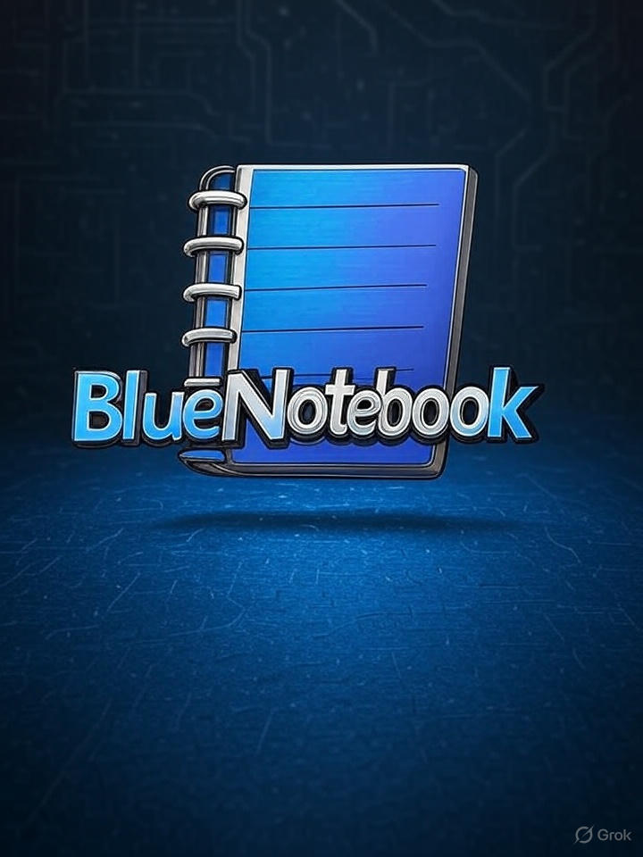

# BlueNotebook

BluenNotebook is is a cross-platform journal



A python copy of RedNotebook using Markdown as internal file format
https://github.com/jendrikseipp/rednotebook


## Structure de projet

```
bluenotebook_editor/
├── main.py              # Point d'entrée
├── gui/
│   ├── __init__.py
│   ├── main_window.py   # Fenêtre principale
│   ├── editor.py        # Zone d'édition
│   └── preview.py       # Aperçu HTML
├── core/
│   ├── __init__.py
│   ├── markdown_parser.py
│   └── file_handler.py
└── resources/
    ├── styles.css
    └── icons/

```

## 