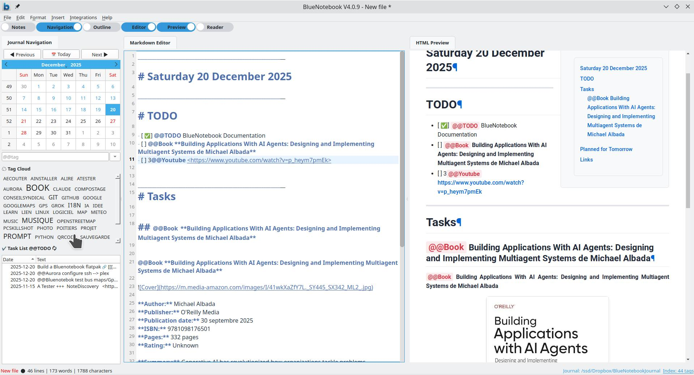
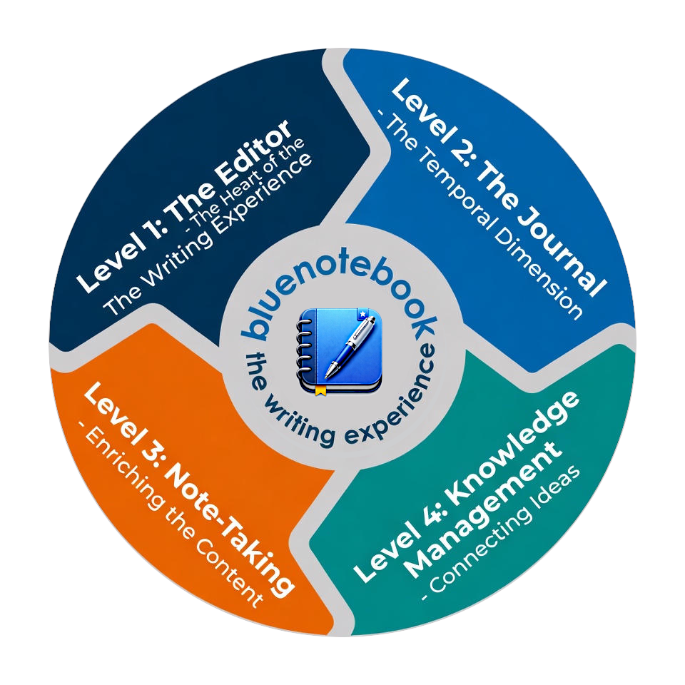
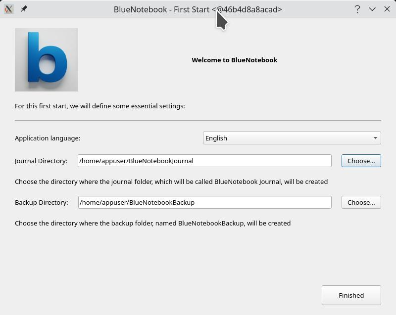
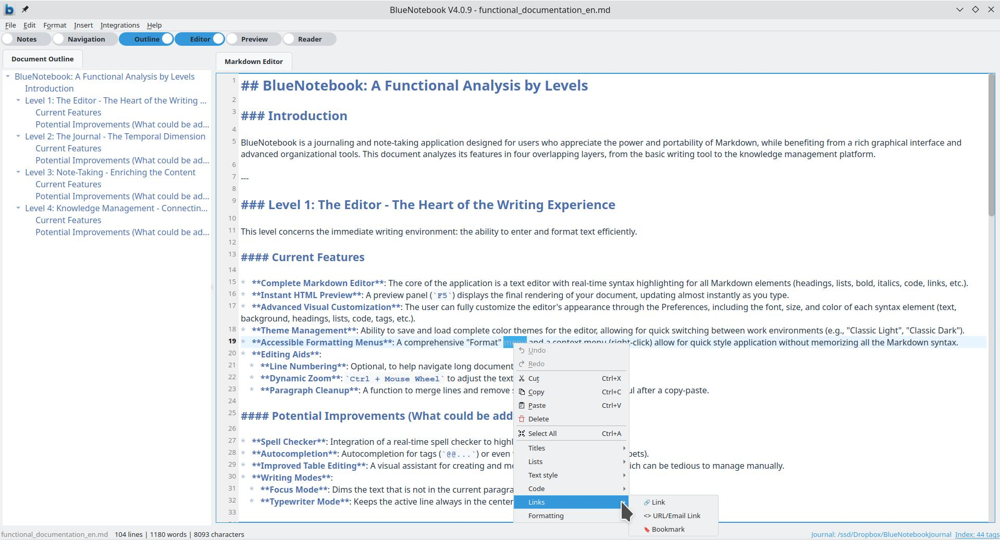
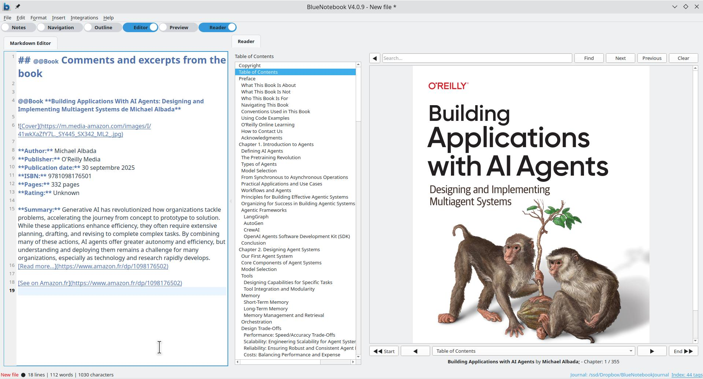
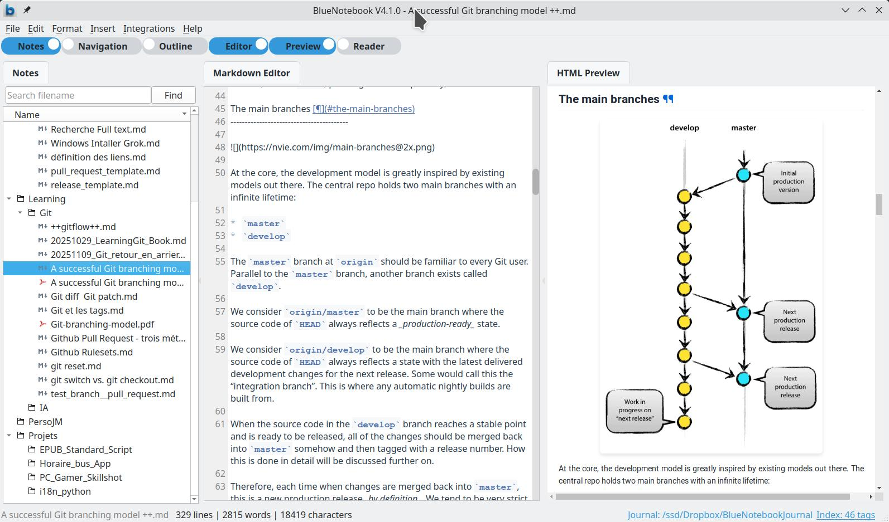
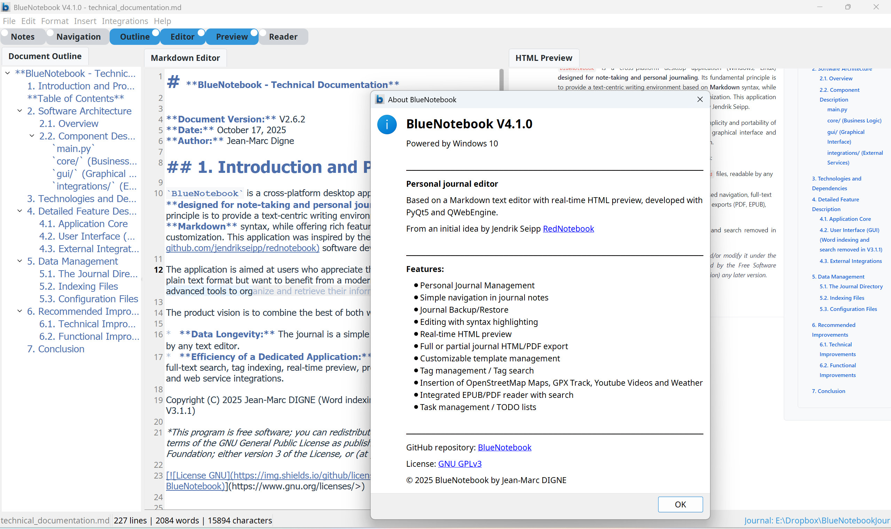
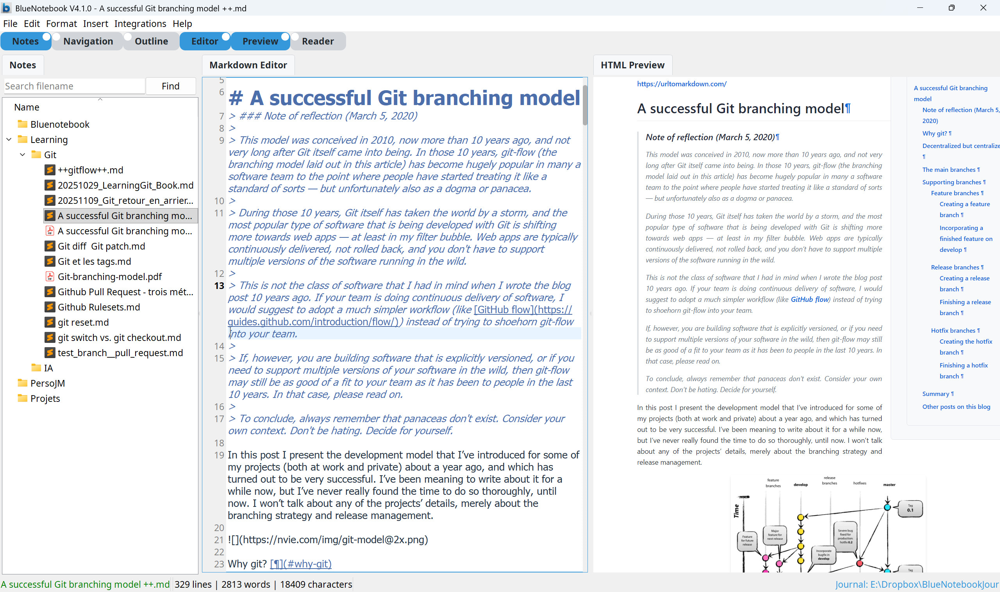

[](https://www.gnu.org/licenses/>)


[](https://img.shields.io/docker/pulls/jmdigne/bluenotebook)


BlueNotebook is a journaling and note-taking desktop application designed for users who appreciate the power and portability of Markdown, while benefiting from a rich graphical interface and advanced organizational tools. This document analyzes its features in four overlapping layers, from the basic writing tool to the knowledge management platform.






### Level 1: The Editor - The Heart of the Writing Experience

This level concerns the immediate writing environment: the ability to enter and format text efficiently.

#### Current Features

*   **Complete Markdown Editor**: The core of the application is a text editor with real-time syntax highlighting for all Markdown elements (headings, lists, bold, italics, code, links, etc.).
*   **Instant HTML Preview**: A preview panel (`F5`) displays the final rendering of your document, updating almost instantly as you type.
*   **Advanced Visual Customization**: The user can fully customize the editor's appearance through the Preferences, including the font, size, and color of each syntax element (text, background, headings, lists, code, tags, etc.).
*   **Theme Management**: Ability to save and load complete color themes for the editor, allowing for quick switching between work environments (e.g., "Classic Light", "Classic Dark").
*   **Accessible Formatting Menus**: A comprehensive "Format" menu and a context menu (right-click) allow for quick style application without memorizing all the Markdown syntax.
*   **Editing Aids**:
    *   **Line Numbering**: Optional, to help navigate long documents.
    *   **Dynamic Zoom**: `Ctrl + Mouse Wheel` to adjust the text size on the fly.
    *   **Paragraph Cleanup**: A function to merge lines and remove superfluous spaces, very useful after a copy-paste.

 

### Level 2: The Journal - The Temporal Dimension

This level focuses on BlueNotebook's main feature: keeping a chronological journal.

#### Current Features

*   **One Note Per Day**: The central concept is one file per day, named `YYYYMMDD.md`. This ensures data simplicity and portability.
*   **Temporal Navigation**: The navigation panel (`F6`) contains a calendar where days with a note are highlighted. A click opens the corresponding note. "Previous," "Next," and "Today" buttons facilitate sequential navigation.
*   **Smart Save Management**: When saving (`Ctrl+S`), if the day's note already exists, the application offers to append the new content, which is ideal for adding thoughts throughout the day.
*   **Complete Backup and Restore**: Integrated tools allow creating a `.zip` archive of the entire journal (notes, images, attachments) and restoring it securely (the current journal is backed up before being replaced).
*   **Journal Export**: Ability to export a selection of notes (by date range and/or tag) into professional formats like **PDF** (paginated, with a cover) and **EPUB** (with a table of contents, cover, and embedded images).

 

### Level 3: Note-Taking - Enriching the Content

This level covers the tools that allow for the creation of rich and structured notes, beyond simple text.

#### Current Features

*   **Template System**:
    *   Create notes from predefined templates (`File > New...`).
    *   Save a current note as a new template (`File > Save as Template...`).
    *   Insert the content of a template anywhere in an existing note.
    *   Use of dynamic placeholders like `{{date}}` and `{{timestamp}}`.
*   **Attachment Management**: An "Attachment" function copies any file (PDF, document, etc.) into an `attachments/` folder in the journal and inserts a Markdown link, ensuring portability.
*   **Rich External Integrations**: The "Integrations" menu allows enriching notes with dynamic content:
    *   **Maps**: Insertion of static maps from GPS coordinates or a GPX trace.
    *   **Multimedia Content**: Integration of YouTube videos (with optional transcript retrieval).
    *   **Contextual Data**: Addition of the day's weather, astronomical data (sunrise/sunset, moon phase), or book information via its ISBN.
    *   **EXIF Data**: Extraction and display of a photo's metadata (location, date, camera).
*   **PDF to Markdown Conversion**: Integrated tool to convert a PDF document into editable Markdown text.

 

### Level 4: Knowledge Management - Connecting Ideas

This level represents the application's ability to help the user organize, retrieve, and create links between their information.

#### Current Features

*   **Tag System**: Use of a simple syntax (`@@tag`) to categorize information. Tags are normalized (case-insensitive and accent-insensitive) for better consistency.
*   **Asynchronous Indexing**: On startup, a background process scans the entire journal to create a tag index, allowing for near-instant searches without blocking the interface.
*   **Search by Tag**: The navigation panel allows searching for a specific tag. The results display the date and context of each occurrence.
*   **Click-to-Navigate**: Clicking on a search result opens the corresponding note and positions the cursor **directly at the line where the tag was found**.
*   **Visual Discovery**:
    *   **Tag Cloud**: Displays the most used tags, offering an overview of the journal's main themes. Clicking a tag starts a search.
    *   **Document Outline** (`F7`): Displays a hierarchical view of the current document's headings, allowing for quick navigation in long and structured notes.
*   **Integrated Document Reader**: The reader panel (`F8`) allows displaying EPUB and PDF documents alongside the editor, facilitating note-taking from external sources.

 ---

 **BlueNotebook Documentation**

[🇺🇸 🇬🇧 BlueNotebook Technical Documentation](./docs/technical_documentation.md)

[🇺🇸 🇬🇧 BlueNotebook Online Help](./bluenotebook/resources/html/online_help.md)

[🇫🇷 🇨🇦 BlueNotebook Documentation Technique](./docs/documentation_technique.md)

[🇫🇷 🇨🇦 BlueNotebook Aide en ligne - French](./bluenotebook/resources/html/aide_en_ligne.md)

 

## How to Launch Bluenotebook 

**New** A docker image and a Flatpak bundle are available with V4.1.4 
An Appimage for Linux  and a Windows installer will soon be available. Stay tuned.

### **Docker image**

A **BlueNotebook** docker image  is available at <https://hub.docker.com/repository/docker/jmdigne/bluenotebook/general>.
You can launch this BlueNotebook Docker image directly by running the `run_docker.sh` script, or manually:

```bash
# get the docker image (2.6GB )
docker pull jmdigne/bluenotebook:4.1.4
#create mandatoruy directories on the host
mkdir -p ~/bluenotebook_docker/config \
         ~/bluenotebook_docker/BlueNotebookJournal \
         ~/bluenotebook_docker/BlueNotebookBackup
# Modify the ownership and access rights
chown -R $(id -u):$(id -g) ~/bluenotebook_docker
chmod -R u+rwX ~/bluenotebook_docker

# Run  the docker image
docker run -it --rm \
    -e DISPLAY=$DISPLAY \
    -v /tmp/.X11-unix:/tmp/.X11-unix \
    -v ~/bluenotebook_docker:/data \
    -v ~/bluenotebook_docker/config:/home/appuser/.config \
    -v ~/bluenotebook_docker/BlueNotebookJournal:/home/appuser/BlueNotebookJournal \
    -v ~/bluenotebook_docker/BlueNotebookBackup:/home/appuser/BlueNotebookBackup \
    --user=$(id -u):$(id -g) \
    jmdigne/bluenotebook:4.1.4
```
.⚠️.⚠️.⚠️ Do not change the Journal and Backup directories on the home screen, as you already configured them before launching the application. You can change the application language (English or French)..⚠️.⚠️.⚠️
 


### **Flatpak bundle**

**New** A Flatpak bundle is available `BlueNotebook.flatpak`

```bash
# Download bundke from github

$ ls -al *.flatpak
-rw-r--r-- 1 jm jm 180191256 janv.  4 13:50 BlueNotebook.flatpak


# Install bundle
$ flatpak install --bundle --user BlueNotebook.flatpak

io.github.lephotographelibre.BlueNotebook permissions:
    ipc      network      fallback-x11      pulseaudio      wayland      x11      dri      file access [1]     dbus access [2]

    [1] home, xdg-config/kdeglobals:ro
    [2] com.canonical.AppMenu.Registrar, org.kde.KGlobalSettings, org.kde.kconfig.notify


        ID                                                     Branch              Op              Remote                          Download
 1. [✓] io.github.lephotographelibre.BlueNotebook              master              i               bluenotebook-origin             0 bytes

Installation complete.
$ flatpak list | grep blue
Jean-Marc DIGNE io.github.lephotographelibre.BlueNotebook       4.1.4   master  bluenotebook-origin     user

# create an alias for BluenNotebook App
$ alias bluenotebook='flatpak run io.github.lephotographelibre.BlueNotebook'

```
Launch bluenotebook


### **Ubuntu/Debian** install from source files


`pyenv` is used to create an isolated Python environment based on Python 3.11.13.

```bash
curl -L https://github.com/pyenv/pyenv-installer/raw/master/bin/pyenv-installer | bash
```

add these lines to `.bash_profile`

```bash
# User specific environment and startup programs
#
export PYENV_ROOT="$HOME/.pyenv"
[[ -d $PYENV_ROOT/bin ]] && export PATH="$PYENV_ROOT/bin:$PATH"
eval "$(pyenv init - bash)"
```

add tothis line to `.bashrc`

```bash
eval "$(pyenv virtualenv-init -)"
```
Install the following librairies/packages

```bash
sudo apt-get update
sudo apt-get install git libcairo2-dev libpango-1.0-0 libgdk-pixbuf2.0-0
# for QtWebEngine
sudo apt-get install libasound2t64

# Launch Bluenotebook
git clone https://github.com/lephotographelibre/BlueNotebook.git
cd Bluenotebook
./run_bluenotebook.sh
```
You can add a launcher for this application using the `install.sh` script, which will create the `bluenotebook.desktop` file and register it correctly.


### **Windows 10/11** install from source files


`pyenv-win` is used to create an isolated Python environment based on Python 3.11.9. Therefore, install pyenv-win first: <https://github.com/pyenv-win/pyenv-win>

- Install `pyenv-win`

```powershell
PS C:\Users\xx> Invoke-WebRequest -UseBasicParsing -Uri "https://raw.githubusercontent.com/pyenv-win/pyenv-win/master/pyenv-win/install-pyenv-win.ps1" -OutFile "./install-pyenv-win.ps1"; &"./install-pyenv-win.ps1"
Reopen PowerShell
PS C:\Users\xx>  pyenv --version
```

- Add the following to your PATH variable:

`C:\Users\xx\.pyenv\pyenv-win\bin` 
`C:\Users\xx\.pyenv\pyenv-win\shims`

- Add the `pyenv-virtualenv` plugin:

```powershell
git clone https://github.com/pyenv/pyenv-virtualenv.git "$(pyenv root)\plugins\pyenv-virtualenv"
```

- Install the required Cairo libraries (including `libcairo-2.dll`) by downloading and running the following installer:

  <https://github.com/tschoonj/GTK-for-Windows-Runtime-Environment-Installer/releases/download/2022-01-04/gtk3-runtime-3.24.31-2022-01-04-ts-win64.exe>

- Add the bin directory containing `libcairo-2.dll` to your PATH environment variable:

  `C:\Program Files\GTK3-Runtime Win64\bin`

Open a PowerShell terminal.
```powershell
#Launch Bluenotebook
PS C:\Users\xx> git clone https://github.com/lephotographelibre/BlueNotebook.git
PS C:\Users\xx> cd Bluenotebook
PS C:\Users\xx> ./run_bluenotebook.bat
```


## **Screenshots**


The Markdown Editor and outline panel 

The Journal and the Task Manager on Linux 

The Integrated EPUB/PDF Reader 

Note-taking management 

The Markdown Editor on Windows 

Note-taking management on Windows 


## **License**

This program is free software: you can redistribute it and/or modify it under the terms of the GNU General Public License as published by the Free Software Foundation, either version 3 of the License, or (at your option) any later version.

This program is distributed in the hope that it will be useful, but WITHOUT ANY WARRANTY; without even the implied warranty of MERCHANTABILITY or FITNESS FOR A PARTICULAR PURPOSE.  See the GNU General Public License for more details.

You should have received a copy of the GNU General Public License along with this program.  If not, see <https://www.gnu.org/licenses/>.

Copyright (C) 2026 Jean-Marc DIGNE
