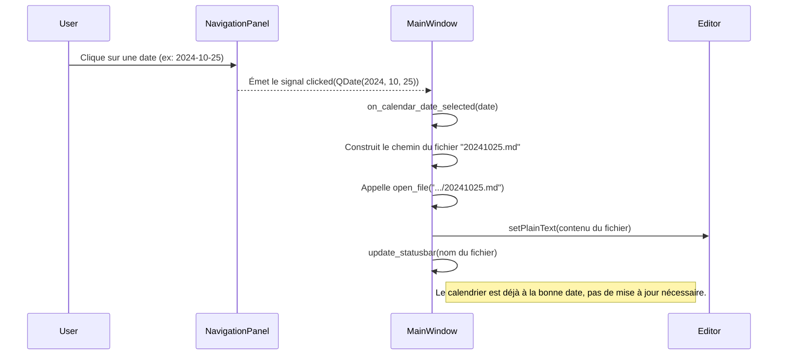

# Spécification Technique : Panneau de Navigation

## 1. Vue d'ensemble fonctionnelle

Le panneau de navigation est un composant clé de l'interface de BlueNotebook, situé à gauche de l'éditeur. Son objectif principal est de fournir à l'utilisateur des outils visuels et interactifs pour explorer ses notes de journal de manière temporelle.

Il est composé de deux éléments principaux :
1.  **Un Calendrier Interactif (`QCalendarWidget`)** : Affiche une vue mensuelle et met en évidence les jours pour lesquels une note existe.
2.  **Des Boutons de Navigation (`QToolBar`)** : Permettent de se déplacer séquentiellement entre les notes existantes et de revenir rapidement à la date du jour.

Le panneau peut être affiché ou masqué via le menu `Affichage -> Basculer Navigation` ou le raccourci `F6`.

## 2. Architecture Technique et Composants

La fonctionnalité de navigation est principalement implémentée dans la classe `MainWindow` (`gui/main_window.py`), qui orchestre les interactions entre le panneau de navigation, l'éditeur de texte et le système de gestion de fichiers.

### 2.1. Composants PyQt5 utilisés

-   **`QDockWidget`** : Le panneau de navigation est un `QDockWidget` pour lui permettre d'être "docké" à gauche, redimensionné, et masqué/affiché facilement.
    ```python
    # Dans MainWindow.setup_ui()
    self.navigation_dock = QDockWidget(self.tr("🧭 Navigation"), self)
    self.addDockWidget(Qt.LeftDockWidgetArea, self.navigation_dock)
    ```

-   **`QCalendarWidget`** : Le cœur visuel de la navigation.
    ```python
    # Dans une méthode de création du panneau de navigation
    self.calendar = QCalendarWidget()
    self.calendar.setGridVisible(True)
    ```

-   **`QToolBar`** et **`QAction`** : Utilisés pour créer la barre d'outils contenant les boutons "Jour Précédent", "Aujourd'hui", et "Jour Suivant".
    ```python
    # Dans une méthode de création du panneau de navigation
    nav_toolbar = QToolBar()
    self.prev_day_action = QAction(QIcon.fromTheme("go-previous"), self.tr("Jour précédent"), self)
    self.today_action = QAction(QIcon.fromTheme("go-home"), self.tr("Aujourd'hui"), self)
    self.next_day_action = QAction(QIcon.fromTheme("go-next"), self.tr("Jour suivant"), self)
    nav_toolbar.addAction(self.prev_day_action)
    # ... etc.
    ```

### 2.2. Logique de synchronisation (Signaux et Slots)

La synchronisation entre le calendrier, les boutons et l'éditeur est gérée par le système de signaux et slots de PyQt5.

-   **Clic sur une date du calendrier** : Le signal `clicked(QDate)` du `QCalendarWidget` est connecté à un slot dans `MainWindow`.
    ```python
    # Connexion du signal
    self.calendar.clicked.connect(self.on_calendar_date_selected)

    # Slot de traitement
    def on_calendar_date_selected(self, date):
        # 1. Convertit la QDate en nom de fichier (ex: "20241026.md")
        # 2. Construit le chemin complet du fichier dans le répertoire du journal.
        # 3. Appelle la méthode `self.open_file(filepath)` pour charger la note.
        # 4. Si le fichier n'existe pas, affiche un message dans la barre de statut.
    ```

-   **Chargement d'un fichier dans l'éditeur** : Chaque fois qu'un fichier est ouvert (que ce soit au démarrage, via `Fichier > Ouvrir` ou via le calendrier), une méthode de mise à jour est appelée pour synchroniser le calendrier.
    ```python
    # Dans la méthode open_file(filepath)
    def open_file(self, filepath):
        # ... (logique d'ouverture de fichier) ...
        self.update_calendar_for_file(filepath)

    def update_calendar_for_file(self, filepath):
        # 1. Extrait la date du nom de fichier (ex: "20241026.md" -> QDate(2024, 10, 26)).
        # 2. Si la date est valide, appelle `self.calendar.setSelectedDate(date)`.
    ```

-   **Clic sur les boutons de navigation** : Chaque `QAction` (`prev_day_action`, `next_day_action`) est connecté à un slot.
    ```python
    # Connexion des signaux
    self.prev_day_action.triggered.connect(self.find_previous_note)
    self.next_day_action.triggered.connect(self.find_next_note)

    # Slot de traitement (exemple pour "Jour Précédent")
    def find_previous_note(self):
        # 1. Récupère la date actuelle de l'éditeur.
        # 2. Scanne le répertoire du journal à la recherche de tous les fichiers .md.
        # 3. Trie les fichiers par ordre antéchronologique.
        # 4. Trouve le premier fichier dont la date est antérieure à la date actuelle.
        # 5. Si un fichier est trouvé, l'ouvre avec `self.open_file(found_filepath)`.
    ```

## 3. Mise en évidence des jours avec notes

Pour que l'utilisateur puisse identifier visuellement les jours contenant une note, une mise en forme spéciale est appliquée au calendrier.

-   **Déclenchement** : Ce processus est déclenché au démarrage de l'application et chaque fois que le répertoire du journal est modifié (`Fichier -> Ouvrir Journal`).
-   **Processus** :
    1.  Une méthode `scan_journal_for_notes()` parcourt tous les fichiers `.md` du répertoire du journal.
    2.  Pour chaque fichier, elle extrait la date de son nom.
    3.  Ces dates sont stockées dans un `set` pour un accès rapide : `self.notes_with_dates`.
    4.  Un `QTextCharFormat` est créé pour définir le style (par exemple, couleur bleue, texte en gras).
        ```python
        self.note_format = QTextCharFormat()
        self.note_format.setForeground(QColor("#3498db"))
        self.note_format.setFontWeight(QFont.Bold)
        ```
    5.  La méthode parcourt les dates dans `self.notes_with_dates` et applique le format à chaque date correspondante dans le calendrier.
        ```python
        for date in self.notes_with_dates:
            self.calendar.setDateTextFormat(date, self.note_format)
        ```
-   **Mise à jour** : Le calendrier est rafraîchi en appelant cette logique de scan et de formatage à chaque changement de répertoire de journal.

## 4. Diagramme de séquence (Interaction utilisateur)

Voici un diagramme illustrant le flux d'événements lorsqu'un utilisateur clique sur une date dans le calendrier.


 

<!--
[PROMPT_SUGGESTION]Maintenant, mets à jour le fichier de documentation technique principal pour inclure une section sur la navigation en se basant sur ce nouveau fichier.[/PROMPT_SUGGESTION]
[PROMPT_SUGGESTION]Peux-tu générer le code Python pour implémenter la logique décrite dans `V1.2.2_navigation.md` dans le fichier `main_window.py` ?[/PROMPT_SUGGESTION]
 
