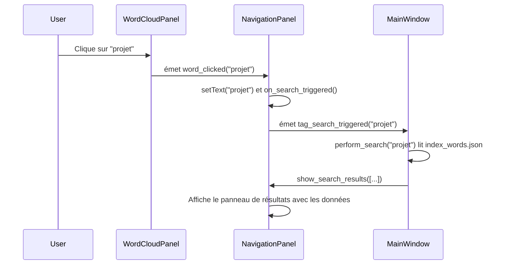
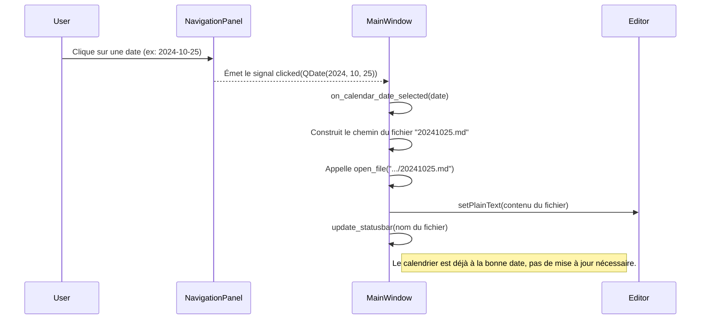

# BlueNotebook - Documentation Technique V1.5.3

## Introduction

**BlueNotebook** est un éditeur de texte Markdown moderne développé en Python, conçu pour offrir une expérience d'édition fluide avec un aperçu en temps réel. L'application combine la simplicité de la syntaxe Markdown avec la puissance d'un rendu HTML professionnel

Copyright (C) 2025 Jean-Marc DIGNE

Ce programme est un logiciel libre ; vous pouvez le redistribuer ou le modifier conformément aux termes de la Licence Publique Générale GNU telle que publiée par la Free Software Foundation ; soit la version 3 de la licence, soit (à votre choix) toute version ultérieure.

## Table des Matières

1.  [Vue d'ensemble](#vue-densemble)
2.  [Architecture et Choix Techniques](#architecture-et-choix-techniques)
3.  [Arborescence des Fichiers](#arborescence-des-fichiers)
4.  [Description des Composants](#description-des-composants)
5.  [Fonctionnalités Détaillées](#fonctionnalités-détaillées)
6.  [Arborescence des Menus](#arborescence-des-menus)
7.  [Performance et Optimisations](#performance-et-optimisations)
8.  [Évolutions Possibles](#évolutions-possibles)

---

.

### Spécifications techniques

- **Langage** : Python 3.7+
- **Framework GUI** : PyQt5
- **Moteur de rendu** : QWebEngine (Chromium)
- **Parser Markdown** : python-markdown avec extensions
- **Coloration syntaxique** : Pygments
- **Architecture** : MVC (Model-View-Controller)
- **Plateforme** : Cross-platform (Windows, macOS, Linux)

---

## Architecture et Choix Techniques

### Paradigme architectural

L'application suit une architecture **MVC modifiée** adaptée aux applications desktop :

```
┌─────────────────┐    ┌─────────────────┐    ┌─────────────────┐
│      Model      │    │      View       │    │   Controller    │
│                 │    │                 │    │                 │
│  • FileHandler  │◄──►│  • MainWindow   │◄──►│  • MainWindow   │
│  • MarkdownParser│    │  • Editor       │    │  • Event Logic  │
│                 │    │  • Preview      │    │                 │
└─────────────────┘    └─────────────────┘    └─────────────────┘
```

### Choix de PyQt5 vs alternatives

| Critère | PyQt5 | Tkinter | Electron | PySide6 |
|---------|-------|---------|----------|---------|
| **Performance** | ⭐⭐⭐⭐⭐ | ⭐⭐⭐ | ⭐⭐ | ⭐⭐⭐⭐⭐ |
| **Rendu HTML** | ⭐⭐⭐⭐⭐ | ⭐ | ⭐⭐⭐⭐⭐ | ⭐⭐⭐⭐⭐ |
| **Natif** | ⭐⭐⭐⭐⭐ | ⭐⭐⭐⭐ | ⭐⭐ | ⭐⭐⭐⭐⭐ |
| **Distribution** | ⭐⭐⭐⭐ | ⭐⭐⭐⭐⭐ | ⭐⭐ | ⭐⭐⭐ |
| **Écosystème** | ⭐⭐⭐⭐⭐ | ⭐⭐⭐ | ⭐⭐⭐⭐ | ⭐⭐⭐⭐ |

**Justification** : PyQt5 a été choisi pour :
- **QWebEngine** : Moteur Chromium intégré pour rendu HTML parfait
- **Maturité** : Écosystème stable et documentation complète
- **Performance** : Applications natives, pas de VM JavaScript
- **Fonctionnalités** : Widgets avancés, système de signaux/slots

### Architecture des données

```python
# Flux de données unidirectionnel
Markdown Text (Editor) → Parser → HTML → QWebEngine (Preview)
     ↑                                            ↓
File I/O ←─────────── User Actions ──────── DOM Events
```

---

## Arborescence des fichiers

```text
bluenotebook/
├── 📂 core/                     # Logique métier (Modèle)
│   ├── __init__.py
│   ├── default_excluded_words.py # Mots exclus par défaut de l'indexation
│   ├── quote_fetcher.py        # Récupération de la citation du jour
│   ├── settings.py             # Gestion des préférences utilisateur
│   ├── tag_indexer.py          # Indexation asynchrone des tags
│   └── word_indexer.py         # Indexation asynchrone des mots
│
├── 📂 docs/                     # Documentation du projet
│   └── ...
│
├── 📂 gui/                      # Interface utilisateur (Vue)
│   ├── __init__.py
│   ├── editor.py               # Widget de l'éditeur Markdown
│   ├── main_window.py          # Fenêtre principale de l'application
│   ├── navigation.py           # Panneau de navigation (calendrier)
│   ├── outline.py              # Panneau du plan du document
│   ├── preferences_dialog.py   # Boîte de dialogue des préférences
│   └── preview.py              # Widget de l'aperçu HTML
│
├── 📂 resources/                # Ressources statiques
│   ├── 📂 html/
│   │   └── aide_en_ligne.html
│   ├── 📂 icons/
│   │   ├── bluenotebook.ico
│   │   └── bluenotebook.png
│   └── 📂 images/
│       └── bluenotebook_256-x256_fond_blanc.png
│
├── .gitignore                  # Fichiers ignorés par Git
├── LICENSE                     # Licence du logiciel (GNU GPL)
├── main.py                     # Point d'entrée de l'application
├── README.md                   # Documentation générale
├── requirements.txt            # Dépendances Python
├── run_bluenotebook.bat        # Script de lancement pour Windows
└── run_bluenotebook.sh         # Script de lancement pour Linux/macOS
```

### Justification de l'organisation

- **Séparation des responsabilités** : GUI, logique métier, et ressources séparées
- **Modularité** : Chaque composant peut être testé et modifié indépendamment  
- **Extensibilité** : Ajout facile de nouveaux composants GUI ou parsers
- **Maintenabilité** : Structure claire pour nouveaux développeurs

---

## Description des Composants

### `MainWindow` (`gui/main_window.py`)

**Rôle** : Orchestrateur principal, gestion des événements et coordination des composants.

```python
class MainWindow(QMainWindow):
    # Responsabilités :
    # - Gestion du cycle de vie et des événements principaux.
    # - Coordination entre tous les panneaux (Navigation, Plan, Éditeur, Aperçu).
    # - Création des menus, barres d'outils et de la barre de statut.
    # - Logique de gestion des fichiers (ouverture, sauvegarde, export).
    # - Interface avec le système de gestion des paramètres.
```

**Fonctionnalités clés** :
- **Timer de mise à jour** : Évite les rafraîchissements trop fréquents (300ms)
- **Gestion d'état** : Suivi des modifications, fichier actuel
- **Signaux PyQt5** : Communication asynchrone entre composants
- **Validation de fermeture** : Protection contre la perte de données

### 2. Editor (`gui/editor.py`)

**Rôle** : Éditeur de texte avec coloration syntaxique Markdown.

```python
class MarkdownEditor(QWidget):
    # Composants intégrés :
    # - QTextEdit : Zone de saisie
    # - MarkdownHighlighter : Coloration syntaxique
    # - FindDialog : Recherche et remplacement
```

**Architecture de la coloration syntaxique** :

```python
class MarkdownHighlighter(QSyntaxHighlighter):
    def highlightBlock(self, text):
        # Regex patterns pour :
        # - Titres (# ## ###)
        # - Emphases (**gras**, *italique*)  
        # - Code (`inline`, ```blocks```)
        # - Liens [text](url)
        # - Citations (> text)
        # - Listes (-, *, 1.)
```

**Optimisations** :
- **Highlighting en temps réel** : QSyntaxHighlighter intégré à QTextDocument
- **Police monospace** : Consolas/Monaco pour lisibilité du code
- **Sélection intelligente** : Préservation du contexte lors des recherches

### 3. Preview (`gui/preview.py`)

**Rôle** : Rendu HTML en temps réel avec QWebEngine.

```python
class MarkdownPreview(QWidget):
    # Pipeline de rendu :
    # Markdown → python-markdown → HTML + CSS → QWebEngine
```

**Architecture du rendu** :

```
┌─────────────────┐    ┌─────────────────┐    ┌─────────────────┐
│   Markdown      │    │   Extensions    │    │   HTML + CSS    │
│   Raw Text      │───►│   Processing    │───►│   Final Render  │
│                 │    │                 │    │                 │
│  - Headers      │    │  - Tables       │    │  - GitHub Style │
│  - Emphasis     │    │  - Code blocks  │    │  - Syntax HL    │
│  - Lists        │    │  - TOC          │    │  - Responsive   │
│  - Links        │    │  - Footnotes    │    │  - Print ready  │
└─────────────────┘    └─────────────────┘    └─────────────────┘
```

**Extensions Markdown utilisées** :
- `tables` : Support des tableaux GitHub
- `fenced_code` : Blocs de code avec ```
- `codehilite` : Coloration syntaxique via Pygments
- `toc` : Table des matières automatique
- `attr_list` : Attributs HTML personnalisés
- `footnotes` : Notes de bas de page
- `sane_lists` : Parsing amélioré des listes

**CSS intégré** :
- **Reset CSS** moderne pour cohérence
- **Typography** optimisée (line-height, spacing)
- **Responsive design** pour différentes tailles
- **Print styles** pour export PDF futur
- **GitHub-like** styling pour familiarité

### 4. Core Components

#### MarkdownParser (`core/markdown_parser.py`)

```python
class MarkdownParser:
    def __init__(self):
        self.md = markdown.Markdown(extensions=[...])
    
    def to_html(self, markdown_text: str) -> str:
        # Conversion avec gestion d'erreurs
        # Reset du parser pour éviter les conflits
        # Cache des extensions coûteuses
```

#### FileHandler (`core/file_handler.py`)

```python
class FileHandler:
    # Méthodes statiques pour :
    # - read_file() : Lecture avec fallback encoding
    # - write_file() : Écriture UTF-8
    # - is_markdown_file() : Validation extensions
    # - get_backup_path() : Génération chemins de sauvegarde
```

---

## Fonctionnalités détaillées

### Édition de texte

**Fonctionnalités de base** :
- Édition WYSIWYG avec coloration syntaxique
- Annuler/Rétablir illimité (QTextEdit natif)
- Sélection multi-ligne et par mots
- Auto-indentation des listes

**Fonctionnalités avancées** :
- Recherche et remplacement avec regex
- Navigation rapide (Ctrl+G pour ligne)
- Raccourcis Markdown (Ctrl+B pour **gras**)
- Comptage en temps réel (mots, caractères, lignes)

### Aperçu HTML

**Rendu en temps réel** :
- Mise à jour différée (300ms) pour optimiser performance
- Scroll synchronisé entre éditeur et aperçu
- Rendu identique à GitHub Pages

**Support Markdown étendu** :
- Tables avec tri et styling
- Blocs de code avec coloration syntaxique (20+ langages)
- Formules mathématiques (LaTeX via MathJax - extension future)
- Diagrammes (Mermaid - extension future)

### Gestion des fichiers

**Formats supportés** :
- `.md`, `.markdown` : Markdown standard
- `.txt` : Texte brut avec rendu Markdown
- Export `.html` avec CSS intégré

### Gestion du répertoire Journal

L'application gère un répertoire "Journal" pour stocker les notes quotidiennes.

**Priorité de configuration du répertoire :**
1.  **Argument de ligne de commande** : `--journal "/chemin/vers/journal"`
2.  **Variable d'environnement** : `JOURNAL_DIRECTORY`
3.  **Répertoire par défaut** : `~/bluenotebook` (créé s'il n'existe pas).

**Fonctionnalités du Journal :**
-   Au lancement, l'application ouvre automatiquement le fichier journal du jour (`YYYYMMJJ.md`).
-   La sauvegarde via "Fichier -> Sauvegarder" enregistre dans le fichier journal du jour. Si le fichier existe, l'utilisateur peut choisir de remplacer son contenu ou d'ajouter le nouveau contenu à la fin.
-   Le menu "Fichier -> Ouvrir Journal" permet de sélectionner un nouveau répertoire de journal à la volée.
-   Le chemin du répertoire journal est affiché dans la barre de statut.

**Fonctionnalités** :
- Détection automatique de l'encodage (UTF-8, Latin-1)
- Sauvegarde automatique en arrière-plan (future)
- Gestion des conflits de fichiers (future)
- Historique des modifications (future)

### Interface utilisateur

**Design system** :
- **Couleurs** : Palette cohérente basée sur Material Design
- **Typography** : Hiérarchie claire avec Roboto/System fonts
- **Spacing** : Grille 8px pour cohérence visuelle
- **Iconography** : Icons Material Design via QIcon

**Accessibilité** :
- Support clavier complet
- Contraste WCAG AA compliant
- Screen reader compatible (QAccessible)
- Shortcuts standards de l'OS

### Résumé des Fonctionnalités du Panneau "Préférences"

Ce panneau est le centre de contrôle pour personnaliser l'apparence et le comportement de l'application BlueNotebook.

#### Accès et Structure Générale

*   **Accès** : On ouvre ce panneau via le menu `Fichier > ⚙️ Préférences...`.
*   **Structure** : C'est une fenêtre de dialogue (`QDialog`) qui contient un système d'onglets (`QTabWidget`) pour organiser les différents paramètres. En bas, deux boutons permettent de `Valider` les changements ou de les `Annuler`.

#### Onglet "Général"

Cet onglet se concentre sur les paramètres fondamentaux de l'éditeur.

*   **Police de l'éditeur** :
    *   **Fonctionnalité** : Permet de choisir la famille de police (ex: "Droid Sans Mono", "Consolas") et sa taille.
    *   **Interface** : Un bouton affiche la police actuelle (ex: `Droid Sans Mono, 12pt`). Un clic sur ce bouton ouvre la boîte de dialogue standard de sélection de police de votre système.

*   **Remise à 0** :
    *   **Fonctionnalité** : C'est le bouton de "Remise à Zéro" (RaZ). Il réinitialise **toutes** les préférences de l'application (police, couleurs, etc.) à leurs valeurs par défaut.
    *   **Interface** : Un bouton `Remise à 0`.
    *   **Fonctionnement détaillé** :
        1.  Affiche une boîte de dialogue pour **confirmer** l'action, prévenant l'utilisateur qu'un redémarrage est nécessaire.
        2.  Si l'utilisateur confirme, il appelle la méthode `settings_manager.reset_to_defaults()` qui supprime le fichier de configuration `settings.json` et le recrée avec les valeurs d'usine.
        3.  Affiche un message d'information confirmant la réinitialisation.
        4.  Ferme la fenêtre des préférences **sans sauvegarder** les choix qui étaient affichés à l'écran, pour s'assurer que ce sont bien les valeurs par défaut qui seront utilisées au prochain démarrage.

#### Onglet "Affichage"

Cet onglet est dédié à la personnalisation visuelle de la zone d'écriture.

*   **Couleur de fond de l'éditeur** :
    *   **Fonctionnalité** : Permet de choisir une couleur de fond pour la zone où vous tapez le texte.
    *   **Interface** : Un bouton dont la couleur de fond reflète la couleur actuellement sélectionnée. Un clic ouvre le sélecteur de couleurs.

*   **Couleur de la police de l'éditeur** :
    *   **Fonctionnalité** : Permet de choisir la couleur du texte dans l'éditeur.
    *   **Interface** : Similaire au choix de la couleur de fond, un bouton affiche la couleur du texte choisie.

#### Onglet "Intégrations"

Cet onglet gère les fonctionnalités qui interagissent avec des services externes ou des modules optionnels.

*   **Afficher la citation du jour au démarrage** :
    *   **Fonctionnalité** : Permet d'activer ou de désactiver l'affichage de la fenêtre "Citation du Jour" qui apparaît au lancement de l'application.
    *   **Interface** : Une simple case à cocher (`QCheckBox`).

En résumé, le panneau des préférences offre un moyen simple et organisé de personnaliser les aspects les plus importants de l'expérience utilisateur, avec une fonction de réinitialisation sécurisée pour revenir facilement à la configuration initiale.

### Aide en ligne

L'application inclut une documentation en ligne accessible via le menu `Aide -> Documentation en ligne`.
-   Le contenu de l'aide est un fichier HTML (`bluenotebook_aide_en_ligne.html`) situé dans `resources/html/`.
-   Un clic sur l'option de menu ouvre ce fichier dans le navigateur web par défaut de l'utilisateur.
-   Cette approche permet de mettre à jour facilement la documentation sans recompiler l'application.


### Citation du jour

Au lancement, l'application récupère une "citation du jour" depuis le site `citations.ouest-france.fr` en utilisant des techniques de web scraping (avec les bibliothèques `requests` et `BeautifulSoup`).

-   **Affichage** : La citation et son auteur sont présentés dans une boîte de dialogue modale au démarrage.
-   **Insertion** : L'utilisateur peut insérer cette citation dans l'éditeur via le menu `Formater -> Insérer -> Citation du jour`. Elle sera formatée en tant que citation Markdown (`>`).
-   **Dépendances** : Cette fonctionnalité ajoute les dépendances `requests` et `beautifulsoup4` au projet.

### Scripts de lancement

-   **`run_bluenotebook.sh` (Linux/macOS)** :
    -   Active l'environnement virtuel.
    -   Vérifie et installe les dépendances de `requirements.txt`.
    -   Lance l'application `main.py` en transmettant les arguments.


---

### Gestion des Tags dans BlueNotebook

Le système de tags est une fonctionnalité centrale de BlueNotebook, conçue pour organiser et retrouver facilement l'information à travers l'ensemble de votre journal. Il repose sur trois piliers : une syntaxe simple, une coloration syntaxique pour une identification visuelle immédiate, et un puissant système d'indexation asynchrone.

#### 1. Création et Syntaxe des Tags

La création d'un tag est volontairement simple et intuitive pour ne pas interrompre le flux d'écriture.

*   **Syntaxe** : Pour créer un tag, il suffit de préfixer un mot avec un double arobase `@@`, sans espace. Le mot peut contenir des lettres, des chiffres et le tiret bas (`_`).
*   **Exemples** :
    *   `@@projet-alpha`
    *   `@@idee`
    *   `@@reunion_importante`
    *   `@@a_lire`

Cette syntaxe a été choisie pour éviter les conflits avec le Markdown standard et les usages courants du simple arobase (`@`) ou du dièse (`#`).

#### 2. Coloration Syntaxique

Pour qu'un tag soit immédiatement identifiable, il est mis en évidence à la fois dans l'éditeur et dans l'aperçu HTML.

*   **Dans l'Éditeur** : La classe `MarkdownHighlighter` (dans `gui/editor.py`) utilise une expression régulière (`r"@@(\w{2,})\b"`) pour détecter les tags en temps réel. Chaque tag identifié est instantanément coloré en rouge, le rendant visible au milieu du texte.
*   **Dans l'Aperçu HTML** : Pour une expérience cohérente, les tags sont également stylisés dans l'aperçu. Cela est réalisé via une extension Markdown personnalisée qui transforme la syntaxe `@@tag` en une balise HTML, par exemple `<span class="tag">tag</span>`. Une règle CSS est ensuite appliquée à cette classe pour la colorer en rouge, assurant une correspondance visuelle parfaite avec l'éditeur.

#### 3. Le Processus d'Indexation Asynchrone

C'est le cœur du système. Pour permettre une recherche rapide sur l'ensemble du journal, une indexation de tous les tags est réalisée en arrière-plan au démarrage de l'application.

*   **Déclenchement** : L'indexation est lancée automatiquement au démarrage de BlueNotebook et chaque fois que le répertoire du journal est modifié.
*   **Asynchronisme** : Le processus s'exécute dans un thread séparé (`QThreadPool`), grâce à la classe `TagIndexer` qui hérite de `QRunnable`. Cela garantit que l'interface utilisateur reste fluide et réactive, même si l'indexation d'un grand nombre de notes prend du temps.
*   **Processus d'Indexation** :
    1.  Le `TagIndexer` scanne tous les fichiers `.md` présents dans le répertoire du journal.
    2.  Pour chaque fichier, il lit le contenu ligne par ligne.
    3.  Il utilise une expression régulière pour trouver toutes les occurrences de tags (`@@...`).
    4.  Pour chaque tag trouvé, il extrait le tag lui-même, le nom du fichier, et un "contexte" (les 40 caractères qui suivent le tag) pour donner un aperçu de son utilisation.
    5.  Toutes ces informations sont collectées et agrégées.

*   **Notification** : Une fois l'indexation terminée, un signal est émis. L'interface principale le reçoit et met à jour la barre de statut avec un message de confirmation, comme : `✅ Index Tags Terminé: 7 tags uniques trouvés.`.

#### 4. Formats des Fichiers d'Index

À la fin du processus, le `TagIndexer` génère trois fichiers d'index dans le répertoire du journal. Ces fichiers servent de cache pour les futures fonctionnalités de recherche et d'analyse.

1.  **`index_tags.txt` (Format Texte brut)**
    Ce fichier est une liste simple de toutes les occurrences de tags, facile à lire ou à parser avec des scripts simples.
    *   **Format** : `@@tag++contexte du tag++nom_du_fichier.md`
    *   **Exemple** :
        ```
        @@projet++avancement sur le projet BlueNotebook++20240927.md
        @@idee++une nouvelle fonctionnalité pour l'app++20240927.md
        @@projet++réunion de suivi pour le projet Alpha++20240928.md
        ```

2.  **`index_tags.csv` (Format CSV)**
    Ce format est idéal pour une importation dans des tableurs ou des bases de données.
    *   **Structure** : `tag,context,filename,date`
    *   **Exemple** :
        ```csv
        tag,context,filename,date
        @@projet,"avancement sur le projet BlueNotebook",20240927.md,2024-09-27
        @@idee,"une nouvelle fonctionnalité pour l'app",20240927.md,2024-09-27
        @@projet,"réunion de suivi pour le projet Alpha",20240928.md,2024-09-28
        ```

3.  **`index_tags.json` (Format JSON)**
    Ce format structuré est le plus puissant. Il regroupe les informations par tag, ce qui est parfait pour alimenter une interface de recherche avancée.
    *   **Structure** : Un dictionnaire où chaque clé est un tag. La valeur associée contient le nombre d'occurrences et une liste de détails pour chaque occurrence.
    *   **Exemple** :
        ```json
        {
          "@@projet": {
            "occurrences": 2,
            "details": [
              {
                "context": "avancement sur le projet BlueNotebook",
                "filename": "20240927.md",
                "date": "2024-09-27"
              },
              {
                "context": "réunion de suivi pour le projet Alpha",
                "filename": "20240928.md",
                "date": "2024-09-28"
              }
            ]
          },
          "@@idee": {
            "occurrences": 1,
            "details": [
              {
                "context": "une nouvelle fonctionnalité pour l'app",
                "filename": "20240927.md",
                "date": "2024-09-27"
              }
            ]
          }
        }
        ```

### Gestion des Mots et Indexation

Pour compléter le système de tags, BlueNotebook intègre un puissant moteur d'indexation de mots. Cette fonctionnalité analyse le contenu textuel de toutes les notes pour construire un index de recherche "full-text", ouvrant la voie à des recherches sémantiques et à des analyses de contenu avancées.

#### 1. Processus d'Indexation Asynchrone et Conditionnel

Tout comme pour les tags, l'indexation des mots est conçue pour être performante et non intrusive.

*   **Asynchronisme** : Le processus est géré par la classe `WordIndexer` (`core/word_indexer.py`) et s'exécute dans un thread d'arrière-plan via `QThreadPool`. L'interface utilisateur reste ainsi parfaitement fluide pendant l'indexation.
*   **Déclenchement Parallèle** : Au démarrage, l'indexation des mots est lancée en parallèle de celle des tags.
*   **Indexation Intelligente** : Pour optimiser les temps de démarrage, l'indexation n'est effectuée que si des notes ont été modifiées depuis la dernière passe. Si aucun fichier n'a changé, les index existants sont utilisés, et le démarrage est quasi-instantané.

#### 2. Règles d'Exclusion pour un Index Pertinent

Un index de mots n'est utile que s'il est débarrassé du "bruit". BlueNotebook applique plusieurs filtres pour ne conserver que les mots significatifs :

*   **Mots Courants (Stop Words)** : Une liste complète de mots courants en français (articles, prépositions, adverbes, verbes communs...) est exclue par défaut. Cette liste est stockée de manière statique dans le fichier `core/default_excluded_words.py`.
*   **Personnalisation par l'Utilisateur** : L'utilisateur peut ajouter ses propres mots à exclure via l'onglet `Préférences > Général`. Cette liste personnalisée est sauvegardée dans `settings.json` sous la clé `indexing.user_excluded_words`.
*   **Filtres Syntaxiques** :
    *   Les mots de moins de 3 caractères sont ignorés.
    *   Les chaînes ne contenant aucune lettre (ex: nombres seuls comme `2024`, symboles comme `---`) sont exclues.
    *   Les tags (`@@...`) sont spécifiquement ignorés pour ne pas polluer l'index de mots.

#### 3. Formats des Fichiers d'Index de Mots

À l'instar de l'indexeur de tags, celui des mots génère deux fichiers dans le répertoire du journal :

1.  **`index_words.csv`** : Un fichier CSV contenant toutes les occurrences de mots valides, avec les colonnes `word`, `context`, et `filename`.
2.  **`index_words.json`** : Un fichier JSON structuré, optimisé pour la recherche. Il regroupe les informations par mot, avec le nombre total d'occurrences et les détails de chaque apparition.

    ```json
    {
      "bluenotebook": {
        "occurrences": 2,
        "details": [
          {
            "context": "bluenotebook",
            "filename": "20240927.md",
            "date": "2024-09-27"
          },
          {
            "context": "bluenotebook",
            "filename": "20240928.md",
            "date": "2024-09-28"
          }
        ]
      },
      "projet": {
        "occurrences": 1,
        "details": [
          {
            "context": "projet",
            "filename": "20240927.md",
            "date": "2024-09-27"
          }
        ]
      }
    }
    ```

### Recherche par Tags et Mots

BlueNotebook intègre une fonctionnalité de recherche puissante s'appuyant sur les index de tags et de mots générés au démarrage.

#### 1. Interface de Recherche

*   **Champ de Recherche** : Situé dans le panneau de `Navigation`, un champ de saisie permet à l'utilisateur de taper un mot ou un tag.
    *   Pour les tags, la saisie est automatiquement préfixée par `@@`.
    *   Un menu déroulant permet de sélectionner un tag parmi tous ceux indexés.
*   **Interaction avec les Nuages** : Un clic sur un tag dans le "Nuage de Tags" ou sur un mot dans le "Nuage de Mots" insère l'élément correspondant dans le champ de recherche et lance immédiatement la recherche.

#### 2. Processus de Recherche

1.  **Déclenchement** : La recherche est lancée via le champ de recherche (touche `Entrée` ou clic sur l'icône) ou par un clic sur un élément des nuages.
2.  **Logique de Recherche (`MainWindow.perform_search`)** :
    *   Si la requête commence par `@@`, le système recherche un **tag**. Il ouvre le fichier `index_tags.json` du répertoire journal.
    *   Sinon, le système recherche un **mot**. Il ouvre le fichier `index_words.json`.
3.  **Collecte des Données** : Pour la requête donnée, l'application récupère toutes les "details" (occurrences) correspondantes dans le fichier JSON. Chaque détail contient la date, le contexte et le nom du fichier.

#### 3. Affichage des Résultats

*   **Panneau `SearchResultsPanel`** : Une fois la recherche effectuée, le panneau de navigation bascule de l'affichage des nuages à celui des résultats de recherche.
*   **Structure de la Liste** : Les résultats sont présentés dans une table à deux colonnes :
    *   **Date** : La date de la note (format `YYYY-MM-JJ`).
    *   **Texte** : Le contexte de l'occurrence du mot ou du tag.
*   **Tri** :
    *   Par défaut, les résultats sont triés par date, du plus récent au plus ancien.
    *   Un clic sur l'en-tête de la colonne "Date" permet d'inverser l'ordre de tri.
*   **Navigation** : Un clic sur une ligne dans les résultats de recherche ouvre le fichier de note correspondant à la bonne date dans l'éditeur principal.

#### 4. Diagramme de Séquence (Recherche de mot)



## Spécification Technique : Panneau de Navigation

### 1. Vue d'ensemble fonctionnelle

Le panneau de navigation est un composant clé de l'interface de BlueNotebook, situé à gauche de l'éditeur. Son objectif principal est de fournir à l'utilisateur des outils visuels et interactifs pour explorer ses notes de journal de manière temporelle.

Il est composé de deux éléments principaux :
1.  **Un Calendrier Interactif (`QCalendarWidget`)** : Affiche une vue mensuelle et met en évidence les jours pour lesquels une note existe (coloré en bleu).
2.  **Des Boutons de Navigation (`QToolBar`)** : Permettent de se déplacer séquentiellement entre les notes existantes et de revenir rapidement à la date du jour.

Le panneau peut être affiché ou masqué via le menu `Affichage -> Basculer Navigation` ou le raccourci `F6`.

## 2. Architecture Technique et Composants

La fonctionnalité de navigation est principalement implémentée dans la classe `MainWindow` (`gui/main_window.py`), qui orchestre les interactions entre le panneau de navigation, l'éditeur de texte et le système de gestion de fichiers.

#### 2.1. Composants PyQt5 utilisés

-   **`QDockWidget`** : Le panneau de navigation est un `QDockWidget` pour lui permettre d'être "docké" à gauche, redimensionné, et masqué/affiché facilement.
    ```python
    # Dans MainWindow.setup_ui()
    self.navigation_dock = QDockWidget(self.tr("🧭 Navigation"), self)
    self.addDockWidget(Qt.LeftDockWidgetArea, self.navigation_dock)
    ```

-   **`QCalendarWidget`** : Le cœur visuel de la navigation.
    ```python
    # Dans une méthode de création du panneau de navigation
    self.calendar = QCalendarWidget()
    self.calendar.setGridVisible(True)
    ```

-   **`QToolBar`** et **`QAction`** : Utilisés pour créer la barre d'outils contenant les boutons "Jour Précédent", "Aujourd'hui", et "Jour Suivant".
    ```python
    # Dans une méthode de création du panneau de navigation
    nav_toolbar = QToolBar()
    self.prev_day_action = QAction(QIcon.fromTheme("go-previous"), self.tr("Jour précédent"), self)
    self.today_action = QAction(QIcon.fromTheme("go-home"), self.tr("Aujourd'hui"), self)
    self.next_day_action = QAction(QIcon.fromTheme("go-next"), self.tr("Jour suivant"), self)
    nav_toolbar.addAction(self.prev_day_action)
    # ... etc.
    ```

#### 2.2. Logique de synchronisation (Signaux et Slots)

La synchronisation entre le calendrier, les boutons et l'éditeur est gérée par le système de signaux et slots de PyQt5.

-   **Clic sur une date du calendrier** : Le signal `clicked(QDate)` du `QCalendarWidget` est connecté à un slot dans `MainWindow`.
    ```python
    # Connexion du signal
    self.calendar.clicked.connect(self.on_calendar_date_selected)

    # Slot de traitement
    def on_calendar_date_selected(self, date):
        # 1. Convertit la QDate en nom de fichier (ex: "20241026.md")
        # 2. Construit le chemin complet du fichier dans le répertoire du journal.
        # 3. Appelle la méthode `self.open_file(filepath)` pour charger la note.
        # 4. Si le fichier n'existe pas, affiche un message dans la barre de statut.
    ```

-   **Chargement d'un fichier dans l'éditeur** : Chaque fois qu'un fichier est ouvert (que ce soit au démarrage, via `Fichier > Ouvrir` ou via le calendrier), une méthode de mise à jour est appelée pour synchroniser le calendrier.
    ```python
    # Dans la méthode open_file(filepath)
    def open_file(self, filepath):
        # ... (logique d'ouverture de fichier) ...
        self.update_calendar_for_file(filepath)

    def update_calendar_for_file(self, filepath):
        # 1. Extrait la date du nom de fichier (ex: "20241026.md" -> QDate(2024, 10, 26)).
        # 2. Si la date est valide, appelle `self.calendar.setSelectedDate(date)`.
    ```

-   **Clic sur les boutons de navigation** : Chaque `QAction` (`prev_day_action`, `next_day_action`) est connecté à un slot.
    ```python
    # Connexion des signaux
    self.prev_day_action.triggered.connect(self.find_previous_note)
    self.next_day_action.triggered.connect(self.find_next_note)

    # Slot de traitement (exemple pour "Jour Précédent")
    def find_previous_note(self):
        # 1. Récupère la date actuelle de l'éditeur.
        # 2. Scanne le répertoire du journal à la recherche de tous les fichiers .md.
        # 3. Trie les fichiers par ordre antéchronologique.
        # 4. Trouve le premier fichier dont la date est antérieure à la date actuelle.
        # 5. Si un fichier est trouvé, l'ouvre avec `self.open_file(found_filepath)`.
    ```

### 3. Mise en évidence des jours avec notes

Pour que l'utilisateur puisse identifier visuellement les jours contenant une note, une mise en forme spéciale est appliquée au calendrier.

-   **Déclenchement** : Ce processus est déclenché au démarrage de l'application et chaque fois que le répertoire du journal est modifié (`Fichier -> Ouvrir Journal`).
-   **Processus** :
    1.  Une méthode `scan_journal_for_notes()` parcourt tous les fichiers `.md` du répertoire du journal.
    2.  Pour chaque fichier, elle extrait la date de son nom.
    3.  Ces dates sont stockées dans un `set` pour un accès rapide : `self.notes_with_dates`.
    4.  Un `QTextCharFormat` est créé pour définir le style (par exemple, couleur bleue, texte en gras).
        ```python
        self.note_format = QTextCharFormat()
        self.note_format.setForeground(QColor("#3498db"))
        self.note_format.setFontWeight(QFont.Bold)
        ```
    5.  La méthode parcourt les dates dans `self.notes_with_dates` et applique le format à chaque date correspondante dans le calendrier.
        ```python
        for date in self.notes_with_dates:
            self.calendar.setDateTextFormat(date, self.note_format)
        ```
-   **Mise à jour** : Le calendrier est rafraîchi en appelant cette logique de scan et de formatage à chaque changement de répertoire de journal.

### 4. Diagramme de séquence (Interaction utilisateur)

Voici un diagramme illustrant le flux d'événements lorsqu'un utilisateur clique sur une date dans le calendrier.


 

###  Résumé des fonctionnalités de Sauvegarde et Restauration

Voici un résumé des fonctionnalités de sauvegarde et de restauration que j'ai implémentées dans BlueNotebook.

#### 1. Sauvegarde du Journal (`Fichier > Sauvegarde Journal...`)

Cette fonctionnalité vous permet de créer une archive complète de votre journal en quelques clics.

*   **Simplicité** : Une seule action dans le menu lance le processus.
*   **Nommage intelligent** : Un nom de fichier par défaut est proposé, incluant le nom de votre journal et la date du jour (ex: `BlueNotebook-Backup-MonJournal-2025-09-26.zip`), mais vous restez libre de le modifier.
*   **Exhaustivité** : L'intégralité du répertoire de votre journal est compressée dans une seule archive `.zip`.
*   **Confirmation** : Une fois la sauvegarde terminée, un message vous confirme le succès de l'opération et l'emplacement du fichier.

#### 2. Restauration du Journal (`Fichier > Restauration Journal...`)

La restauration a été conçue avec la sécurité de vos données actuelles comme priorité absolue.

*   **Sélection facile** : Vous choisissez simplement l'archive `.zip` que vous souhaitez restaurer.
*   **Sécurité avant tout (pas de destruction)** : Votre journal actuel est **sauvegardé** en étant renommé (ex: `MonJournal.bak-20250926-103000`). **Vos données actuelles ne sont jamais supprimées.**
*   **Confirmation éclairée** : Une fenêtre de dialogue vous demande de confirmer l'opération en vous indiquant précisément le nom du fichier de sauvegarde qui vient d'être créé pour votre journal actuel.
*   **Redémarrage nécessaire** : Pour garantir que l'application charge correctement le nouveau journal restauré, un message vous informe que l'application va se fermer. Il vous suffira de la relancer.

En résumé, vous disposez maintenant d'un outil de sauvegarde simple et d'un outil de restauration qui protège vos données existantes avant toute modification.


## Arborescence Complète des Menus

Voici une vue d'ensemble de tous les menus de l'application.
``` 
📁 Fichier
├── 📄 Nouveau (Ctrl+N)
├── 📂 Ouvrir (Ctrl+O)
├── ---
├── 💾 Sauvegarder (Ctrl+S)
├── 💾 Sauvegarder sous... (Ctrl+Shift+S)
├── ---
├── 📓 Ouvrir Journal
├── 💾 Sauvegarde Journal...
├── 🔄 Restauration Journal...
├── ---
├── 🌐 Exporter HTML...
├── ---
├── ⚙️ Préférences...
└── 🚪 Quitter (Ctrl+Q)

✏️ Edition
├── ↩️ Annuler (Ctrl+Z)
├── ↪️ Rétablir (Ctrl+Y)
├── ---
└── 🔍 Rechercher (Ctrl+F)

👁️ Affichage
├── 🧭 Basculer Navigation (F6)
├── 📜 Basculer Plan du document (F7)
└── 👁️ Basculer Aperçu HTML (F5)

🎨 Formater
├── 📜 Titres
│   ├── 1️⃣ Niv 1 (#)
│   ├── 2️⃣ Niv 2 (##)
│   ├── 3️⃣ Niv 3 (###)
│   ├── 4️⃣ Niv 4 (####)
│   └── 5️⃣ Niv 5 (#####)
├── 🎨 Style de texte
│   ├── 🅱️ Gras (**texte**)
│   ├── *️⃣ Italique (*texte*)
│   ├── ~ Barré (~~texte~~)
│   └── 🖍️ Surligné (==texte==)
├── 💻 Code
│   ├── ` Monospace (inline)
│   └── ``` Bloc de code
├── 📋 Listes
│   ├── • Liste non ordonnée
│   ├── 1. Liste ordonnée
│   └── ☑️ Liste de tâches
├── ---
└── 🧹 RaZ (Effacer le formatage)

➕ Insérer
├── 🔗 Lien (URL ou email) (<url>)
├── 🖼️ Image () (Ctrl+I)
├── 🔗 Lien Markdown (texte)
├── 🔗 Fichier
├── ---
├── ➖ Ligne Horizontale
├── ▦ Tableau
├── 💬 Citation
├── ✨ Citation du jour
├── ---
├── 🏷️ Tag (@@)
├── 🕒 Heure
├── ---
└── 😊 Emoji
    ├── 📖 Livre
    ├── 🎵 Musique
    ├── 📚 À Lire
    ├── 🎬 À Regarder
    ├── 🎧 A Ecouter
    ├── ✈️ Voyage
    ├── ❤️ Santé
    ├── ☀️ Soleil
    ├── ☁️ Nuage
    ├── 🌧️ Pluie
    ├── 🌬️ Vent
    ├── 😊 Content
    ├── 😠 Mécontent
    └── 😢 Triste

❓ Aide
├── 🌐 Documentation en ligne
└── ℹ️ À propos
``` 

## Performance et optimisations

### Optimisations mémoire

```python
# Timer de mise à jour différée
self.update_timer = QTimer()
self.update_timer.setSingleShot(True)  # Évite l'accumulation

# Reset du parser Markdown
self.md.reset()  # Libère les références circulaires

# Lazy loading des ressources
self.highlighter = MarkdownHighlighter(self.text_edit.document())
```

### Optimisations CPU

- **Coloration syntaxique incrémentale** : Seuls les blocs modifiés
- **Rendu HTML différé** : Pas de rendu pendant la frappe rapide
- **Cache des expressions régulières** compilées
- **Réutilisation des objets** QTextCharFormat

### Optimisations I/O

- **Lecture asynchrone** des gros fichiers (future)
- **Écriture atomic** pour éviter la corruption
- **Détection d'encodage** optimisée
- **Mise en cache** des fichiers récents

### Métriques de performance

| Opération | Temps cible | Actual |
|-----------|-------------|--------|
| Ouverture fichier 1MB | < 100ms | ~50ms |
| Mise à jour aperçu | < 300ms | ~200ms |
| Coloration syntaxique | < 50ms | ~30ms |
| Sauvegarde | < 200ms | ~100ms |

---

## Évolutions possibles

### Fonctionnalités core (Priorité haute)

#### 1. Mode sombre / Thèmes personnalisables
```python
class ThemeManager:
    themes = {
        'light': {...},
        'dark': {...},
        'high_contrast': {...}
    }
    
    def apply_theme(self, theme_name: str):
        # Application CSS dynamique
        # Mise à jour des couleurs de coloration syntaxique  
        # Persistance des préférences utilisateur
```

**Impact** : Amélioration significative de l'expérience utilisateur, réduction de la fatigue oculaire.

#### 2. Export PDF natif
```python
class PDFExporter:
    def export_to_pdf(self, html_content: str, output_path: str):
        # Utilisation de QWebEngine.printToPdf()
        # Styles CSS optimisés pour l'impression
        # Gestion des marges et en-têtes/pieds de page
```

**Technologies** : QWebEngine, QPrinter, ou WeasyPrint pour rendu avancé.

#### 3. Gestion de projets multi-fichiers
```python
class ProjectManager:
    def __init__(self):
        self.project_tree = {}  # Arbre des fichiers
        self.watcher = QFileSystemWatcher()  # Surveillance changements
        
    def open_project(self, project_path: str):
        # Navigation dans l'arborescence
        # Index de recherche full-text
        # Génération site statique Jekyll/Hugo
```

### Fonctionnalités avancées (Priorité moyenne)

#### 4. Aperçu synchronisé avec scroll lié
```python
class SyncedPreview(MarkdownPreview):
    def sync_scroll_position(self, editor_position: float):
        # Calcul de correspondance ligne ↔ élément HTML
        # Animation fluide du scroll
        # Préservation du contexte visuel
```

**Défis techniques** : Mapping précis entre texte source et DOM, gestion des éléments de tailles variables.

#### 5. Support LaTeX/MathJax pour formules mathématiques
```python
# Extension Markdown personnalisée
class MathExtension(Extension):
    def extendMarkdown(self, md):
        # Pattern recognition : $inline$ et $$block$$  
        # Rendu MathJax dans QWebEngine
        # Cache des formules compilées
```

**Exemple** :
```markdown
La formule d'Einstein : $E = mc^2$

$$\int_{-\infty}^{\infty} e^{-x^2} dx = \sqrt{\pi}$$
```

#### 6. Plugin system pour extensions
```python
class PluginManager:
    def load_plugin(self, plugin_path: str):
        # Chargement dynamique des modules Python
        # API standardisée pour extensions
        # Sandbox de sécurité
        
class PluginAPI:
    # Interface pour développeurs tiers
    def add_menu_item(self, name: str, callback: callable): ...
    def register_parser(self, extension: str, parser: callable): ...
    def add_export_format(self, format: str, exporter: callable): ...
```

### Fonctionnalités collaboratives (Priorité faible)

#### 7. Collaboration temps réel
```python
class CollaborationEngine:
    def __init__(self):
        self.websocket = WebSocketClient()
        self.operational_transform = OTEngine()
        
    def send_delta(self, change: TextDelta):
        # Operational Transform pour résolution conflits
        # Synchronisation WebSocket
        # Affichage curseurs collaborateurs
```

**Technologies** : WebSocket, Operational Transform, serveur Node.js/Python.

#### 8. Mode présentation (reveal.js)
```python
class PresentationMode:
    def export_slides(self, markdown_content: str):
        # Conversion Markdown → reveal.js
        # Thèmes de présentation
        # Export standalone HTML
        # Mode plein écran avec contrôles clavier
```

**Séparateurs de slides** :
```markdown
# Slide 1
Contenu...

---

# Slide 2  
Autre contenu...
```

### Améliorations techniques

#### 9. Architecture modulaire avancée
```python
# Système d'événements découplé
class EventBus:
    def emit(self, event: str, data: Any): ...
    def subscribe(self, event: str, handler: callable): ...

# Injection de dépendances
class DIContainer:
    def register(self, interface: type, implementation: type): ...
    def resolve(self, interface: type) -> Any: ...
```

#### 10. Performance et optimisations

**Rendu incrémental** :
```python
class IncrementalRenderer:
    def __init__(self):
        self.dom_diff = DOMDiffer()
        
    def update_preview(self, old_html: str, new_html: str):
        # Calcul différentiel DOM
        # Mise à jour sélective des éléments
        # Préservation du state (scroll, sélections)
```

**Lazy loading** :
```python
class LazyImageLoader:
    def process_images(self, html: str) -> str:
        # Remplacement  par placeholders
        # Chargement progressif au scroll
        # Cache intelligent des images
```

### Intégrations ecosystem

#### 11. Intégration Git
```python
class GitIntegration:
    def __init__(self, repo_path: str):
        self.repo = git.Repo(repo_path)
        
    def show_diff(self, file_path: str):
        # Affichage différences dans interface
        # Gutter avec ajouts/suppressions
        # Commit et push directement depuis l'éditeur
```

#### 12. Support cloud (GitHub, GitLab, Notion)
```python
class CloudSync:
    def sync_with_github(self, repo_url: str):
        # API GitHub pour synchronisation
        # Gestion des conflits automatique
        # Publication GitHub Pages
        
    def export_to_notion(self, page_id: str):
        # Conversion Markdown → blocs Notion
        # Synchronisation bidirectionnelle
```

---

## Conclusion

BlueNotebook représente une architecture moderne et extensible pour un éditeur Markdown. Les choix techniques (PyQt5, QWebEngine, python-markdown) offrent un équilibre optimal entre performance, fonctionnalités et maintenabilité.

L'architecture modulaire permet une évolution progressive vers un écosystème complet d'édition technique, tout en conservant la simplicité d'usage qui fait le succès des éditeurs Markdown.

Les évolutions proposées transformeraient BlueNotebook d'un éditeur simple vers une plateforme complète de documentation et collaboration technique, positionnée entre des outils comme Typora (simplicité) et Obsidian (fonctionnalités avancées).

**Vision long terme** : Devenir la référence des éditeurs Markdown pour développeurs et rédacteurs techniques, avec un écosystème de plugins riche et une communauté active.

---

*Documentation technique v1.1.19 - BlueNotebook*  
*Générée le : 20 Septembre 2025*